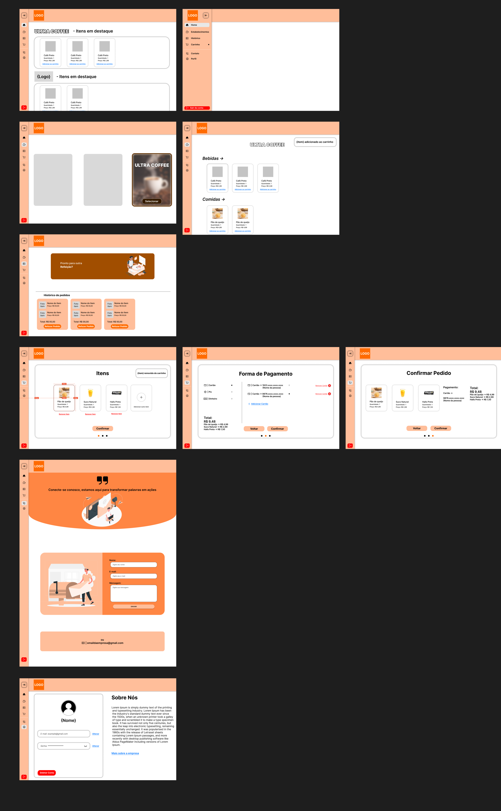
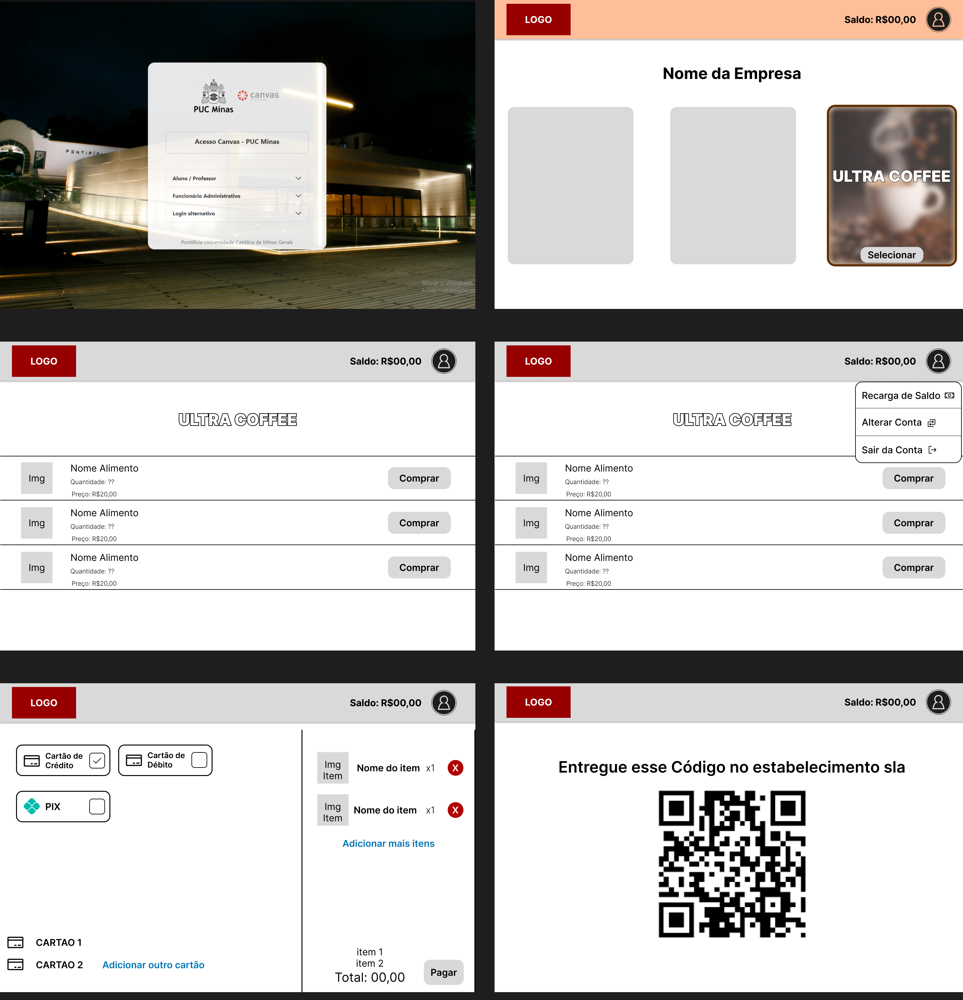

# Informações do Projeto
`TÍTULO DO PROJETO`  

FoodFlow

`CURSO` 

Engenharia de Software

## Participantes

 Membros da equipe:
 - Arthur Henrique Teixeira e Silva Bacelete
 - Davi Benjamin Guimarães
 - Alexandre Augusto dos Reis Junior
 - André Nestor Celino
 - Felipe Araújo Monteiro
 - João Pedro Tavares e Amorim

# Estrutura do Documento

- [Informações do Projeto](#informações-do-projeto)
  - [Participantes](#participantes)
- [Estrutura do Documento](#estrutura-do-documento)
- [Introdução](#introdução)
  - [Problema](#problema)
  - [Objetivos](#objetivos)
  - [Justificativa](#justificativa)
  - [Público-Alvo](#público-alvo)
- [Especificações do Projeto](#especificações-do-projeto)
  - [Personas e Mapas de Empatia](#personas-e-mapas-de-empatia)
  - [Histórias de Usuários](#histórias-de-usuários)
  - [Requisitos](#requisitos)
    - [Requisitos Funcionais](#requisitos-funcionais)
    - [Requisitos não Funcionais](#requisitos-não-funcionais)
  - [Restrições](#restrições)
- [Projeto de Interface](#projeto-de-interface)
  - [User Flow](#user-flow)
  - [Wireframes](#wireframes)
- [Metodologia](#metodologia)
  - [Divisão de Papéis](#divisão-de-papéis)
  - [Ferramentas](#ferramentas)
  - [Controle de Versão](#controle-de-versão)
- [Projeto da Solução](#projeto-da-solução)
  - [Tecnologias Utilizadas](#tecnologias-utilizadas)
  - [Arquitetura da solução](#arquitetura-da-solução)
- [Avaliação da Aplicação](#avaliação-da-aplicação)
  - [Plano de Testes](#plano-de-testes)
  - [Ferramentas de Testes (Opcional)](#ferramentas-de-testes-opcional)
  - [Registros de Testes](#registros-de-testes)
- [Referências](#referências)

# Introdução

## Problema
 Um dos problemas mais significativos a serem abordados é o tempo gasto em fila de estabelecimentos da PUC-Minas. Essa questão não apenas resulta
 em atrasos para as aulas, mas pode também desencadear uma série de outros
 incovenientes.

## Objetivos

 O objetivo principal do nosso projeto é integrar e aproximar a cantina dos 
 alunos de forma que a compra e retirada dos lanches aconteça de maneira hábil
 e suficiente para o seu consumo. Assim, nos comprometemos com uma gestão
 eficiente do tempo de consumo e de demanda das filas, tornando-as menos
 demoradas e cheias.

## Justificativa

 De acordo com entrevistas realizadas com alunos e por experiência dos
 integrantes do grupos, percebemos que demoramos muito tempo para realizar
 a compra de alimentos nos estabelecimentos da PUC-Minas, assim não restando
 tempo suficiente para que possamos comer devagar e saborear o alimento.
 Por isso decidimos criar um software para que as compras possam ser feitas
 antes mesmo de chegar ao campus e podendo pegar o alimento quando quisermos.

## Público-Alvo

 O nosso publico alvo são alunos,
 funcionários e até mesmo visitantes da PUC-Minas.
 
# Especificações do Projeto

Para a elaboração do Projeto, contamos com a utilização de ferramentas como o Discord (para comunicação), o Miro (etapa de entendimento e exploração de Design Thinking), além do Figma (para a elaboração do protótipo) e do GitHub.

## Personas e Mapas de Empatia

As personas identificadas no nosso projeto conta com uma maioria de estudantes que buscam um atendimento agilizado e eficaz nos estabelecimentos da PUC. Aqui estão os exemplos de personas geradas:

- Pedro, 21 anos, treina bastante durante a semana e utiliza das cantinas um local para um consumo de calórias maior. Pedro precisa consumir uma quantidade de calorias maior em um pouco intervalo de tempo. O atendimento rápido é crucial para Pedro. 
- Gabriela, 20 anos, é uma estudante dedicada que sonha em ser uma juiz renomada. Devido a isso, Gabriela possui um dia a dia agitado com os estudos, serviço e outras atividades complementares. Gabriela precisa de um atendimento agilizado para lanchar e voltar ás aulas.
- Rayssa, 22 anos, sonha em ser engenheira e é uma estudante extrovertida. Rayssa deseja lanchar com calma enquanto conversa com seus amigos da faculdade;

## Histórias de Usuários

Com base na análise das personas forma identificadas as seguintes histórias de usuários:

|EU COMO... `PERSONA`| QUERO/PRECISO ... `FUNCIONALIDADE` |PARA ... `MOTIVO/VALOR`                 |
|--------------------|------------------------------------|----------------------------------------|
| Aluno  | Ver as opções de alimentos           | Escolher os alimentos antes de entrar na fila, para proporcionar uma experiência mais rápida e eficiente|
| Aluno  | Ver o valor dos alimentos          | Conferir se tem o valor necessário para a compra e se o preço é justo |
| Aluno  | Fazer a compra diretamente pelo site| Ter uma experiência mais rápida e eficiente |
| Proprietario de uma lanchonete  | Cadastrar seu estabelecimento (lanchonete) no site| Estar entre as opções de estabelecimentos presentes, aumentando a sua visibilidade|
| Proprietario de uma lanchonete  | Adicionar e atualizar o seu catálogo de alimentos| Os potenciais clientes vejam o seu catálogo de produtos mesmo antes de chegarem presencialmente no local|
| Aluno  | Ver as opções de estabelecimentos| Conseguir ver as opções de locais, e ver qual atenda com as suas necessidades e desejos no momento|

## Requisitos

As tabelas que se seguem apresentam os requisitos funcionais e não funcionais que detalham o escopo do projeto.

### Requisitos Funcionais

|ID    | Descrição do Requisito  | Prioridade |
|------|-----------------------------------------|----|
|RF-001| Permitir que o usuário cadastre tarefas | ALTA |
|RF-002| Cadastramento do estabelecimento e aluno  | ALTA |
|RF-003| Variedade de estabelecimentos | ALTA |
|RF-004| Sistema de catálogo (opção de bebida e lanche) | ALTA |
|RF-005| Cadastramento de lanches pelo estabelecimento | ALTA |
|RF-006| Adicionar/remover lanches e bebidas pelo estabelecimento | ALTA |
|RF-007| Atualização de preços pelo estabelecimento | ALTA |
|RF-008| Cadastro da forma de pagamento pelo aluno | ALTA |
|RF-009| QR Code Gerado para o aluno | ALTA |
|RF-010| Sistema de Feedback Estabelecimento/Aluno | MÉDIA |
|RF-011| Histórico de pedidos daquele lanchonete | MÉDIA |
|RF-012| Sistema de filtragem dos alimentos (preço, demanda, etc.) | MÉDIA |

### Requisitos não Funcionais

|ID     | Descrição do Requisito  |Prioridade |
|-------|-------------------------|----|
|RNF-001| O sistema deve ser responsivo para rodar em dispositivos móveis | ALTA | 
|RNF-002| Deve processar requisições do usuário em no máximo 3s | MÉDIA | 
|RNF-003| Confiabilidade das informações de privacidade dos alunos (como os dados do pagamento) | ALTA | 
|RNF-004| O consumo de dados móveis deve ser otimizado | MÉDIA | 
|RNF-005| A demanda deve afetar minimamente o desempenho do aplicativo | MÉDIA | 

## Restrições

O projeto está restrito pelos itens apresentados na tabela a seguir.

|ID| Restrição                                             |
|--|-------------------------------------------------------|
|01| O projeto deverá ser entregue até o final do semestre |
|02| Não pode ser desenvolvido um módulo de backend        |
|03| O aplicativo está restrito a utilização dentro das PUC's        |

# Projeto de Interface

O nosso projeto de interface inicial foi realizado no Figma de forma que a maioria dos requisitos funcionais fossem concebidos. No link abaixo, podemos observar uma tela inicial de login e cadastro para clientes e estabelecimentos da PUC Minas. Além disso, o nosso projeto de interface conta com: 
  - Uma página inicial onde os estabelecimentos colocam os seus produtos de destaque á mostra para os consumidores;
  - Uma tela para seleção do estabelecimento PUC Minas e nele a visualização de seus produtos (comidas, bebidas, balas, chocolates, etc.);
  - Uma tela de histórico de pedidos; 
  - Uma tela de efetuação do pagamento dos produtos selecionados no carrinho e o envio do QR Code via email.
    

## User Flow

## Wireframes

 

# Metodologia

Nos baseamos na metodologia Scrum, no qual planejamos o projeto e em seguido avaliamos, selecionamos, desenvolvemos e revisamos. A liderança da equipe se manteve de maneira diluída, embora alguns participantes se sobressairam, cada um teve a sua tarefa e o trabalho foi realizado de maneira organizada, com um apoio mútuo, a partir do backlog do nosso projeto, sempre nos atualizando do que precisava ser feito. O nosso grupo utilizou das diversas ferramentas disponíveis para a concepção e idealização do projeto e a gestão via GitHub foi feita de maneira compartilhada.

## Divisão de Papéis

- Arthur Henrique Teixeira e Silva Bacelete: Coordenação do grupo, Design Thinking (Miro) e Documentação do Projeto
- Davi Benjamin Guimarães: Coordenação do grupo, Design Thinking (Miro)
- Alexandre Augusto dos Reis Junior: Design Thinking (Miro)
- André Nestor Celino: Elaboração dos Slides, Figma e Design Thinking (Miro)
- Felipe Araújo Monteiro: Design Thinking (Miro), Figma e UserFlow
- João Pedro Tavares e Amorim: Documentação do Projeto e Design Thinking (Miro).

## Ferramentas

| Ambiente  | Plataforma              |Link de Acesso |
|-----------|-------------------------|---------------|
|Processo de Design Thinkgin  | Miro | https://miro.com/app/board/uXjVNiWgZ_8=/ | 
|Repositório de código | GitHub | https://github.com/ICEI-PUC-Minas-PMGES-TI/pmg-es-2024-1-ti1-2401100-g4-fila-na-cantina-1/tree/master/codigo | 
|UserFlow | FlowmApp | https://app.flowmapp.com/share/projects/63ff843f-1931-497a-abc0-81384ff451e8/userflow/d503cdb2-1665-4ded-8429-00da65cb4ffe | 
|Protótipo Interativo | MavelApp ou Figma | https://www.figma.com/file/LIeNCpbdiaeYrSqSiKq2N7?type=design | 

## Controle de Versão
O grupo colaborou no projeto através de commits regulares em branches separadas, documentando o progresso de cada membro. Após revisões e testes, as alterações foram integradas à branch principal (main) por meio de merges, garantindo a coesão e a qualidade do código final.

# Projeto da Solução
Deste modo, o problema identificado está no tempo desperdiçado em filas dentro das instituições da PUC-Minas e todo o incômodo gerado. De acordo com a solução aqui apresentada, o projeto tem a finalidade de integrar as cantinas aos alunos, podendo escolher seus lanches alguns minutos antes de sair da sala de aula. Dessa maneira, pretendemos garantir uma administração eficiente do tempo e da quantidade de pessoas nas filas, evitando que as filas ocorram e que, se ocorrerem, sejam demasiado demoradas.

## Tecnologias Utilizadas

As tecnologias que solucionarão o problema acima incluirão: 

HTML (HyperText Markup Language): estruturação do conteúdo da aplicação web 

CSS (Cascading Style Sheets): Estilização da aplicação para torná-la mais atraente 

JavaScript(JS): adição de interatividade e funcionalidade dinâmica 

Bootstrap: framework CSS para desenvolvimento de interfaces responsivas na web móveis primeiro 

Firebase: serviços de backend para autenticação, banco de dados, hospedagem e função em nuvem

Firebase Authentication: gerenciamento de autenticação do usuário 

Firebase Firestore: banco de dados em tempo real do NoSQL 

Firebase Hosting: hospedagem da aplicação web 

> Descreva aqui qual(is) tecnologias você vai usar para resolver o seu
> problema, ou seja, implementar a sua solução. Liste todas as
> tecnologias envolvidas, linguagens a serem utilizadas, serviços web,
> frameworks, bibliotecas, IDEs de desenvolvimento, e ferramentas.
> Apresente também uma figura explicando como as tecnologias estão
> relacionadas ou como uma interação do usuário com o sistema vai ser
> conduzida, por onde ela passa até retornar uma resposta ao usuário.
> 
> Inclua os diagramas de User Flow, esboços criados pelo grupo
> (stoyboards), além dos protótipos de telas (wireframes). Descreva cada
> item textualmente comentando e complementando o que está apresentado
> nas imagens.

## Arquitetura da solução

......  COLOQUE AQUI O SEU TEXTO E O DIAGRAMA DE ARQUITETURA .......

> Inclua um diagrama da solução e descreva os módulos e as tecnologias
> que fazem parte da solução. Discorra sobre o diagrama.
> 
> **Exemplo do diagrama de Arquitetura**:
> 
> 

# Avaliação da Aplicação

Para avaliar a aplicação desenvolvida, foram realizados testes detalhados que cobrem os principais cenários de uso, garantindo que todos os requisitos funcionais e não funcionais fossem satisfeitos. Abaixo, apresentamos os cenários de testes utilizados, demonstrando a conformidade com os requisitos estabelecidos.  

 

Cenário de Teste 1: Cadastro de Usuário  

 

Objetivo: Verificar se o sistema permite que novos usuários se cadastrem corretamente.  

 

Requisitos Atendidos: RF-002 (Cadastramento do estabelecimento e aluno)  

 

Passos do Teste:  

 

Acessar a página de cadastro.  

 

Preencher o formulário com informações válidas (nome, e-mail, senha).  

 

Submeter o formulário.  

 

Verificar se o usuário é redirecionado para a página inicial e se uma mensagem de sucesso é exibida.  

 

Resultado Esperado: Usuário cadastrado com sucesso e redirecionado para a página inicial.  

 

Cenário de Teste 2: Login de Usuário  

 

Objetivo: Verificar se o sistema autentica corretamente os usuários cadastrados.  

 

Requisitos Atendidos: RF-002 (Cadastramento do estabelecimento e aluno)  

 

Passos do Teste:  

 

Acessar a página de login.  

 

Preencher o formulário de login com e-mail e senha válidos.  

 

Submeter o formulário.  

 

Verificar se o usuário é redirecionado para a página de seleção de estabelecimentos.  

 

Resultado Esperado: Usuário autenticado com sucesso e redirecionado para a página de seleção de estabelecimentos.  

 

Cenário de Teste 3: Visualização de Estabelecimentos  

 

Objetivo: Verificar se o usuário pode visualizar a lista de estabelecimentos cadastrados.  

 

Requisitos Atendidos: RF-003 (Variedade de estabelecimentos)  

 

Passos do Teste:  

 

Acessar a página de seleção de estabelecimentos.  

 

Verificar se a lista de estabelecimentos é exibida corretamente.  

 

Selecionar um estabelecimento e verificar se os produtos são exibidos.  

 

Resultado Esperado: Lista de estabelecimentos exibida corretamente e produtos visíveis após a seleção.  

 

Cenário de Teste 4: Adição de Produtos ao Carrinho  

 

Objetivo: Verificar se o usuário pode adicionar produtos ao carrinho de compras.  

 

Requisitos Atendidos: RF-004 (Sistema de catálogo), RF-006 (Adicionar/remover lanches e bebidas pelo estabelecimento)  

 

Passos do Teste:  

 

Navegar até a página de produtos de um estabelecimento.  

 

Selecionar um produto e adicionar ao carrinho.  

 

Verificar se o produto aparece no carrinho.  

 

Resultado Esperado: Produto adicionado ao carrinho com sucesso.  

 

Cenário de Teste 5: Finalização de Compra  

 

Objetivo: Verificar se o usuário pode finalizar a compra e receber um QR Code.  

 

Requisitos Atendidos: RF-008 (Cadastro da forma de pagamento pelo aluno), RF-009 (QR Code Gerado para o aluno)  

 

Passos do Teste:  

 

Acessar o carrinho de compras.  

 

Selecionar a forma de pagamento e completar o pagamento.  

 

Verificar se o QR Code é gerado e exibido.  

 

Resultado Esperado: Compra finalizada e QR Code gerado corretamente.  

 

Cenário de Teste 6: Cadastro de Estabelecimento  

 

Objetivo: Verificar se novos estabelecimentos podem ser cadastrados corretamente.  

 

Requisitos Atendidos: RF-002 (Cadastramento do estabelecimento e aluno)  

 

Passos do Teste:  

 

Acessar a página de cadastro de estabelecimento.  

 

Preencher o formulário com informações válidas (nome, endereço, categoria).  

 

Submeter o formulário.  

 

Verificar se o estabelecimento é adicionado à lista de estabelecimentos.  

 

Resultado Esperado: Estabelecimento cadastrado com sucesso e exibido na lista.  

 

Cenário de Teste 7: Atualização de Catálogo de Produtos  

 

Objetivo: Verificar se os estabelecimentos podem adicionar e atualizar seus produtos.  

 

Requisitos Atendidos: RF-005 (Cadastramento de lanches pelo estabelecimento), RF-007 (Atualização de preços pelo estabelecimento)  

 

Passos do Teste:  

 

Acessar a página de gerenciamento de produtos do estabelecimento.  

 

Adicionar um novo produto ou atualizar um produto existente.  

 

Verificar se as alterações são refletidas na lista de produtos.  

 

Resultado Esperado: Produtos adicionados ou atualizados com sucesso.  

 

Cenário de Teste 8: Sistema de Feedback  

 

Objetivo: Verificar se os usuários podem fornecer feedback sobre os estabelecimentos e vice-versa.  

 

Requisitos Atendidos: RF-010 (Sistema de Feedback Estabelecimento/Aluno)  

 

Passos do Teste:  

 

Acessar a página de feedback.  

 

Preencher e submeter o formulário de feedback.  

 

Verificar se o feedback é registrado e exibido corretamente.  

 

Resultado Esperado: Feedback registrado e exibido corretamente. 

> Apresente os cenários de testes utilizados na realização dos testes da
> sua aplicação. Escolha cenários de testes que demonstrem os requisitos
> sendo satisfeitos.

## Plano de Testes

......  COLOQUE AQUI O SEU TEXTO ......
 
> Enumere quais cenários de testes foram selecionados para teste. Neste
> tópico o grupo deve detalhar quais funcionalidades avaliadas, o grupo
> de usuários que foi escolhido para participar do teste e as
> ferramentas utilizadas.
> 
> **Links Úteis**:
> - [IBM - Criação e Geração de Planos de Teste](https://www.ibm.com/developerworks/br/local/rational/criacao_geracao_planos_testes_software/index.html)
> - [Práticas e Técnicas de Testes Ágeis](http://assiste.serpro.gov.br/serproagil/Apresenta/slides.pdf)
> -  [Teste de Software: Conceitos e tipos de testes](https://blog.onedaytesting.com.br/teste-de-software/)

## Ferramentas de Testes (Opcional)

......  COLOQUE AQUI O SEU TEXTO ......

> Comente sobre as ferramentas de testes utilizadas.
> 
> **Links Úteis**:
> - [Ferramentas de Test para Java Script](https://geekflare.com/javascript-unit-testing/)
> - [UX Tools](https://uxdesign.cc/ux-user-research-and-user-testing-tools-2d339d379dc7)

## Registros de Testes

......  COLOQUE AQUI O SEU TEXTO ......

> Discorra sobre os resultados do teste. Ressaltando pontos fortes e
> fracos identificados na solução. Comente como o grupo pretende atacar
> esses pontos nas próximas iterações. Apresente as falhas detectadas e
> as melhorias geradas a partir dos resultados obtidos nos testes.

# Referências

......  COLOQUE AQUI O SEU TEXTO ......

> Inclua todas as referências (livros, artigos, sites, etc) utilizados
> no desenvolvimento do trabalho.
> 
> **Links Úteis**:
> - [Formato ABNT](https://www.normastecnicas.com/abnt/trabalhos-academicos/referencias/)
> - [Referências Bibliográficas da ABNT](https://comunidade.rockcontent.com/referencia-bibliografica-abnt/)
